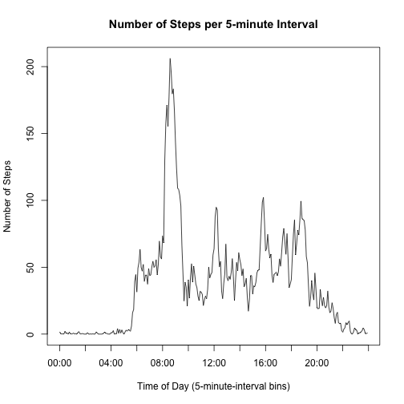
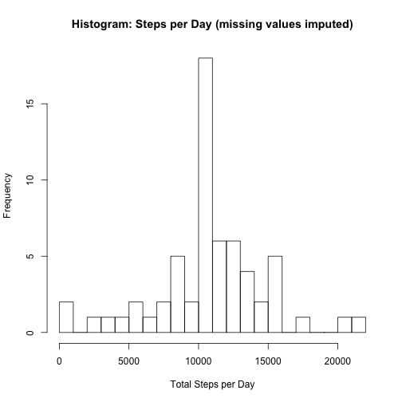
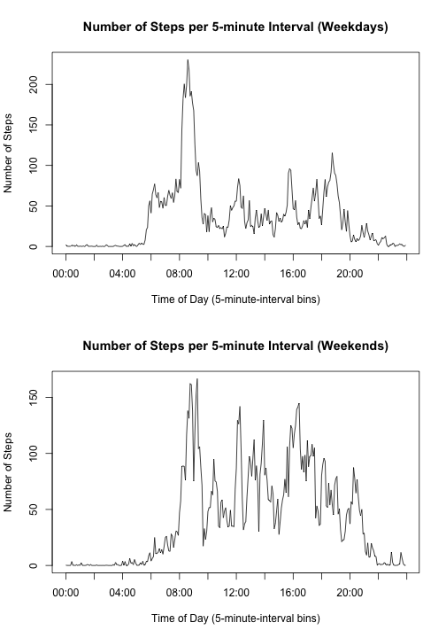

---
title: "Peer Assessment 1"
date: "August 15, 2015"
output: html_document
---    
#### Section I - Loading and pre-processing the data
Load into a data frame the personal activity monitoring device data stored in the file `activity.csv` in the working directory. Format the data collection times (column `interval`) to be more human readable using a 24-hour time format, and create a new data frame that excludes any missing data points.


```r
options(scipen=999)
df_raw <- read.csv("activity.csv")
df_raw$interval <- sprintf("%04s", df_raw$interval)
df_raw$interval <- paste0(substr(df_raw$interval, 1, 2), ':',
                          substr(df_raw$interval, 3, 4))
df_complete <- df_raw[complete.cases(df_raw),]
```

#### Section II - What is mean total number of steps taken per day?


```r
df_complete_sum_day <- aggregate(steps ~ date, data = df_complete, sum)
mean_steps_day <- round(mean(df_complete_sum_day$steps), 2)
median_steps_day <- median(df_complete_sum_day$steps)
```

Based on the personal activity monitoring device data, the mean total number of steps taken per day by the devices user was **10766.19** and the median total number of steps taken per day was **10765**. The overall distribution of days by total numbers of steps is presented in the following histogram.


```r
hist(df_complete_sum_day$steps, breaks = 21, xlab = 'Total Steps per Day',
     main = 'Histogram: Steps per Day')
```

 

#### Section III - What is the average daily activity pattern?

The following line plot shows the average number of steps taken per 5-minute interval of the day throughout the period of the data collection.

```r
df_complete_avg_interval <- aggregate(steps ~ interval, data = df_complete, mean)
colnames(df_complete_avg_interval) <- c("interval", "steps.avg")
interval_max <- df_complete_avg_interval[df_complete_avg_interval$steps.avg==
                            max(df_complete_avg_interval$steps.avg),]$interval
x_axis <- c(1, c(1:12) * 24 + 1)
plot(c(1:288), df_complete_avg_interval$steps.avg, type = 'l', 
     xlab = 'Time of Day (5-minute-interval bins)', ylab = 'Number of Steps',
     main = 'Number of Steps per 5-minute Interval', xaxt="n")
axis(1, at=x_axis, labels=df_complete_avg_interval$interval[x_axis])
```

 
As the plot shows, there is a large spike in the number of steps taken during the morning hours between 8am and 10am, with more moderate step counts being seen at other times during the morning, afternoon, and early evening. The number of steps taken tends to trail off after about 8pm, and remains very low throughout the late-night hours. The interval with the greatest mean number of steps taken occurs at **08:35**.

#### Section IV - Imputing missing values


```r
require(plyr)
missing_steps <- sum(is.na(df_raw$steps))
```

The raw data set contains **2304** missing values. To alleviate any distortions in the study results that might result from missing data, any missing data points were imputed by substituting the average value over the entire data set for the specific 5-minute interval of each missing data point.

```r
df_imputed <- join(x = df_raw, y = df_complete_avg_interval, 
                 by = "interval", type = "left")
df_imputed$steps[is.na(df_imputed$steps)] <- df_imputed$steps.avg[is.na(df_imputed$steps)]
df_imputed_sum_day <- aggregate(steps ~ date, data = df_imputed, sum)
df_imputed_sum_day$steps <- as.integer(round(df_imputed_sum_day$steps, 0))
mean_steps_day_imputed <- round(mean(df_imputed_sum_day$steps), 2)
median_steps_day_imputed <- median(df_imputed_sum_day$steps)
```
The resulting data set had an average number of steps per day of **10766.16** and a median number of steps per day of **10766**. Each of these measures of central tendency were very close to the values based on the raw data set. The histogram below shows the overall distribution of days by total numbers of steps after filling in the missing data points. As the histogram shows, including the substituted data tends to greatly increase the number of days falling into the 10-11,000-steps/day bin.

```r
hist(df_imputed_sum_day$steps, breaks = 21, 
     xlab = 'Total Steps per Day',
     main = 'Histogram: Steps per Day (missing values imputed)')
```

 

#### Section V - Are there differences in activity patterns between weekdays and weekends?

Continuing to use the data set containing imputed values for missing points, the data were then split into weekday and weekend groups to determine differences in daily walking activity during these two periods. As the data show, activity tends to be more evenly dispersed over the entire day during the weekend and also tends to continue at higher levels later into the evening than is seen on weekdays.

```r
weekdays1 <- c('Monday', 'Tuesday', 'Wednesday', 'Thursday', 'Friday')
w_day <- c('weekend', 'weekday')[(weekdays(as.Date(df_imputed$date)) %in% weekdays1)+1L]
df_imputed <- cbind(df_imputed, w_day)
df_weekday_avg_interval <- aggregate(steps ~ interval, 
                                     data = df_imputed[df_imputed$w_day=="weekday",], mean)
df_weekend_avg_interval <- aggregate(steps ~ interval, 
                                     data = df_imputed[df_imputed$w_day=="weekend",], mean)
par(mfrow=c(2,1)) 
plot(c(1:288), df_weekday_avg_interval$steps, type = 'l', 
     xlab = 'Time of Day (5-minute-interval bins)', ylab = 'Number of Steps',
     main = 'Number of Steps per 5-minute Interval (Weekdays)', xaxt="n")
axis(1, at=x_axis, labels=df_weekday_avg_interval$interval[x_axis])
plot(c(1:288), df_weekend_avg_interval$steps, type = 'l', 
     xlab = 'Time of Day (5-minute-interval bins)', ylab = 'Number of Steps',
     main = 'Number of Steps per 5-minute Interval (Weekends)', xaxt="n")
axis(1, at=x_axis, labels=df_weekend_avg_interval$interval[x_axis])
```

 
